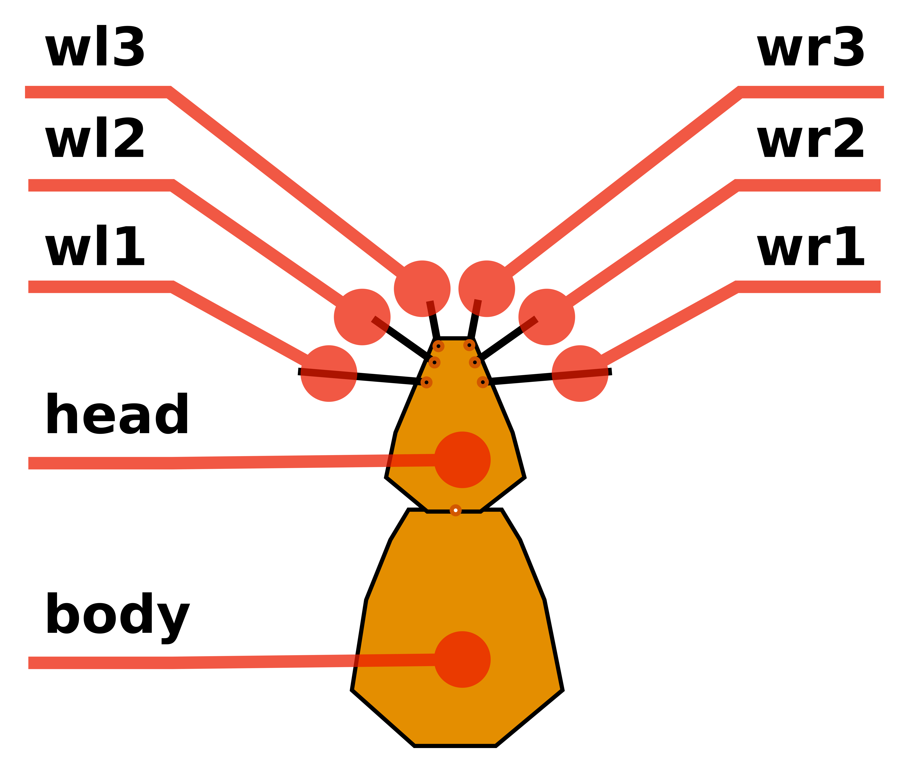
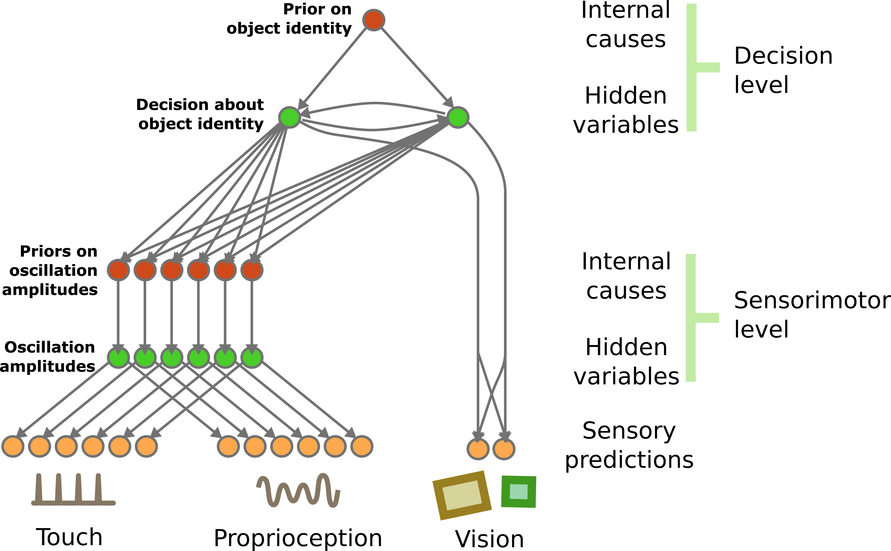
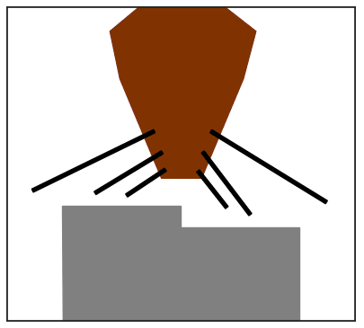

### Active Inference Whiskers Model 

## Introduction

This project inplements an Active Inference model that simulates a
rodent's behavior during object recognition. It is based on the idea that the
brain constantly engages in predictive processing and action selection to
minimize the discrepancy between its predictions and incoming sensory
information. The model includes a generative model that predicts the tactile
and visual consequences of interacting with objects through whisking.
Discrepancies between these predictions and actual sensory inputs result in
error signals, which are used to update the beliefs of the internal model and
optimize actions. The simulated rodent adapts its whisking behavior based on
the predicted dynamics of whiskers and can use visual information as a prior to
adapt whisker dynamics even before contact with the object. The model aims to
explain how whisker movements and visual information are combined during object
recognition.


<table style="border-collapse: collapse; border: 0;">
<tr>
<td style="border: 0; width: 400px;">
 
</td>
<td style="border: 0; width: 600px;">

</td>
</tr>
<tr>
<td colspan=2 style="border: 0; width: 300px;">
 
</td>
</td>
</tr>
</table>


## Installation

1. Create a virtual environment:

    *   Create a new directory for your project and navigate to it in the command line.

    *  Create the virual environment 
        
                    python -m venv myenv


    * Activate the virtual environment: 
        * for Windows:
    
                    myenv\Scripts\activate

        * for macOS/Linux:
    
                    myenv\bin\activate

2. Install packages from requirements.txt:

    * Navigate to the directory containing the requirements.txt file.
    *Run the command 
        
        pip install -r requirements.txt

## Description
    
The main modules    

    src/
    ├── analysis
    │   └── stats
    │       ├── crosscorr.py  -- methods for timeseries crosscorrelations 
    │       └── fourier_transform.py -- methods for FFT 
    └── simulation
        ├── ActiveInferenceModel.py -- python implementation of the Active Inference Model
        ├── run_simulation.py 
        │    └── run_simulation -- execute a single trial  
        └── generate_data.py 
             ├── run_trial -- execute a single trial  
             └── run_simulation -- execute a battery of n trials with all conditions 
                                   (obj0-touch)-(obj0-multimodal)-(obj1-touch)-(obj1-multimodal)  

## Usage

This is a simple example of how to use the simulator. For a more complete example see the test in **run_simulation.py**
        
```python
from src.simulation.run_simulation import run_simulation

# runs a single trial
data, frames = run_simulation()

# saves the simulation as a gif animation
make_simulation_gif_video(
    folder='.',
    root=f"video_filename",
    frames=frames,
)
```
